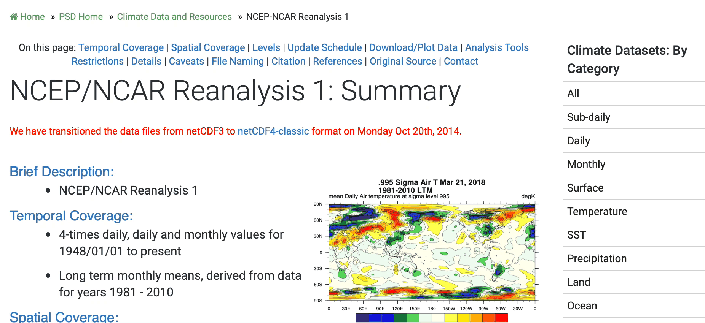

# LagTrack

Functions are written to be used both as part of the GUI and as standalone. 


## Input parameters

### DEM
The DEM is automatically retrieved using the [readhgt](https://uk.mathworks.com/matlabcentral/fileexchange/36379-readhgt-import-download-nasa-srtm-data-files-hgt) function.

#### Download the DEM
Using the GUI:

```
downloadSRTM
```

Using the command line:

```
downloadSRTM(latMin, latMax, lonMin, lonMax, resolution, name)
```

- ```latMin```, ```latMax```: Minimum and maximum latitudes in decimal degrees. Negative in southern hemisphere
- ```lonMin```, ```lonMax```: Minimum and maximum longitudes in decimal degrees. Negative in western hemisphere
- ```resolution```: Resolution to interpolate the DEM (m). This is obsolete (but still required for now), as the code will automatically attempt retrieving SRTM1 data
- ```name```: Name of the DEM dataset stored in ```input/dem/```

#### DEM format
The format of the DEM used in LagTrack is a Matlab structure containing called ```dem``` and containing the following fields, where $m$ and $n$ are the number of cells in the $y$ and $x$ dimensions, respectively. Adopt this convention to use a DEM obtained from a different source in LagTrack. 
- ```X```: $m \times n$ matrix of longitudes
- ```Y```: $m \times n$ matrix of latitudes. In the Matlab matrix, ```dem.Y(1,:)``` should be the southernmost points and ```dem.Y(end,:)``` the northernmost
- ```Z```: $m \times n$ matrix of elevations (m asl). The orientation should be the same as ```dem.Y```
- ```res```: Cell size (m) (obsolete)

### Atmospheric data
Atmospheric data in LagTrack can be retrieved from the [NCEP/NCAR Reanalysis 1](https://www.esrl.noaa.gov/psd/data/gridded/data.ncep.reanalysis.html), the [NCEP-DOE Reanalysis 2](https://www.esrl.noaa.gov/psd/data/gridded/data.ncep.reanalysis2.html) and the [ECMWF Era-Interim](https://www.ecmwf.int/en/forecasts/datasets/archive-datasets/reanalysis-datasets/era-interim) datasets. To access Era-Interim data, it is assumed that the procedure described [here](https://confluence.ecmwf.int/display/WEBAPI/Access+ECMWF+Public+Datasets) has been followed. To test the installation, run the following command in Matlab. I no message is output, then the ECMWF library is working properly:

```
!python -c "from ecmwfapi import ECMWFDataServer"
```

#### Download atmospheric data
Using the GUI:

```
downloadATM
```

Using the command line:

```
downloadATM(latMin, latMax, lonMin, lonMax, yearMin, yearMax, monthMin, monthMax, name, dataset)
```

- ```latMin```, ```latMax```: Minimum and maximum latitudes in decimal degrees. Negative in southern hemisphere
- ```lonMin```, ```lonMax```: Minimum and maximum longitudes in decimal degrees. Negative in western hemisphere
- ```yearMin```, ```yearMax```: Minimum and maximum years to retrieve (e.g. 2017). For a single year, ```yearMin```=```yearMax```
- ```monthMin```, ```monthMax```: Minimum and maximum months to retrieve (e.g. 02 for Feb). For a single month, ```monthMin```=```monthMax```
- ```name```: Name of the atmospheric dataset stored in ```input/wind/```
- ```dataset```: Reanalysis dataset, accepts ```'Interim'```, ```'Reanalysis1'``` and ```'Reanalysis2'```

#### Format of atmospheric data
The format of the DEM used in LagTrack is a Matlab structure containing called ```atm``` and containing the following fields:

- ```lat```, ```lon```: Latitude and longitude vectors. ```lat``` is a $[m\times1]$ vector and ```lon``` is a $[n]\times1]$ vector, where $m$ and $n$ are the number of points along latitude and longitude, respectively
- ```level```: Geopotential height (mb). $[l\times1]$ vector, where $l$ is the number of levels
- ```time```: Date vector of each data point in number of days from January 0, 0000 (see Matlab function $datenum$). $[t\times1]$ vector, where $t$ is the number of data point in time
- ```temp```: Temperature ($\text{\textdegree}$K). $[m\times n\times l\times t]$ matrix
- ```alt```: Altitude (m asl). $[m\times n\times l\times t]$ matrix
- ```humid```: Relative humidity (%). $[m\times n\times l\times t]$ matrix
- ```u```, ```v```: U and V components of wind (m/s). Each is a $[m\times n\times l\times t]$ matrix
- ```rhoair```: Atmosphere density (kg/m$^2$). $[m\times n\times l\times t]$ matrix
- ```muair```: Atmosphere dynamic viscosity viscosity (Pa$\cdot$s). $[m\times n\times l\times t]$ matrix

#### Post processing the atmospheric data
Post-processing of the atmospheric dataset should be automatic upon successful completion of the download step. To manually post-process wind data, use:

```
processATM(name, dataset, latMin, latMax, lonMin, lonMax, yearMin, yearMax, monthMin, monthMax)
```

:warning: All variables except ```rhoair``` and ```muair``` must be provided in the NetCDF file. ```rhoair``` and ```muair``` are automatically computed by the ```processATM``` function.

#### Manually downloading Reanalysis data
**Era-Interim:** There are two possible options. To access data in [batch access mode](https://confluence.ecmwf.int/display/WEBAPI/Access+ECMWF+Public+Datasets) outside of LagTrack, use the python template provided in ```code/functions/dependencies/ecmwf-api-client-python/download_ECMWF_tmp.py```. Otherwise, NetCDF should be manually downloaded *for each separate month* from [here]([here](https://apps.ecmwf.int/datasets/data/interim-full-daily/levtype=pl/)) and placed in the folder ```input/wind/windName/```. NetCDF files should contain the following variables: ```latitude```, ```longitude```, ```time```, ```level```, ```u```, ```v```, ```z```, ```t``` and ```r```. More details on the procedure is available [here](https://e5k.github.io/codes/2017/09/15/tephraprob-ecmwf-manual/).

**Reanalysis 1/2:** [Reanalysis 1](https://www.esrl.noaa.gov/psd/data/gridded/data.ncep.reanalysis.pressure.html) and [Reanalysis 2](https://www.esrl.noaa.gov/psd/data/gridded/data.ncep.reanalysis2.pressure.html) must be retrieved *for entire years* at *pressure levels*. Variables to be retrieved are ```Air temperature```, ```Geopotential height```, ```Relative humidity```, ```u-wind``` and ```v-wind```.




Requirements:
- Matlab 2014b
- GUI Layout toolbox: https://www.mathworks.com/matlabcentral/fileexchange/47982-gui-layout-toolbox

Main script:
LagTrack

To do:
- Check extent of DEM and atmospheric data
- Implement Mohssen's changes


### Dependencies

| Function | Description | Credit |
| ---- | ---- | ----|
| ```readhgt``` | Downloads SRTM data | [François Beauducel](https://uk.mathworks.com/matlabcentral/fileexchange/36379-readhgt-import-download-nasa-srtm-data-files-hgt) |